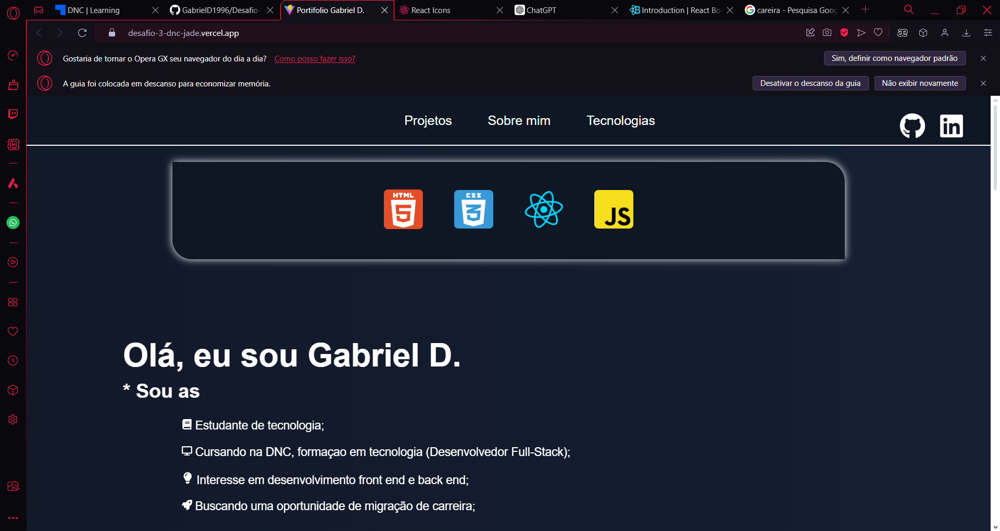

# Portifolio Leonardo Giampaulo

link do site disponibilizado : https://desafio4dnc.vercel.app/


# Meu Portfólio de Desenvolvedor Full Stack

## Introdução

Bem-vindo ao meu portfólio! Este projeto foi desenvolvido com o objetivo de apresentar minhas habilidades e experiências como desenvolvedor full stack. Utilizando tecnologias modernas como React Vite, React Icons e React Bootstrap, criei uma interface atraente e responsiva que destaca meus projetos, habilidades e trajetória de aprendizagem na área.

## Tecnologias Utilizadas

- **React Vite**: Escolhi o Vite como ferramenta de construção para seu desempenho superior e experiência de desenvolvimento rápida. Ele facilita a configuração e otimização do projeto, permitindo um desenvolvimento mais ágil.
    [Documentação](https://pt.vitejs.dev/guide/)
- **React Icons**: Utilizei a biblioteca React Icons para adicionar ícones de alta qualidade ao portfólio, proporcionando uma melhor experiência visual e interativa.
    [Documentação](https://react-icons.github.io/react-icons/)
- **React Bootstrap**: Integrei React Bootstrap para estilização e design responsivo. Com seus componentes pré-estilizados, pude construir uma interface consistente e atraente com menos esforço.
    [Documentação](https://react-bootstrap.netlify.app/docs/getting-started/introduction)


## Como Executar o Projeto

### Pré-requisitos

- Node.js 
- npm 

### Passos para Executar

1. Clone o repositório:
    ```sh
    git clone https://github.com/glleonnardo/desafio4dnc.git

2. Navegue até o diretório do projeto:
    ```sh
     cd desafio4dnc

3. Instale as dependências:
    ```sh
      npm install
4. Execute o servidor de desenvolvimento:
    ```sh
    npm run dev
5. Acesse o Projeto:
    [O comando do passo "4" ira disponibilizar o link para acesso](http://localhost:5173/)

### Capturas de Tela


    


